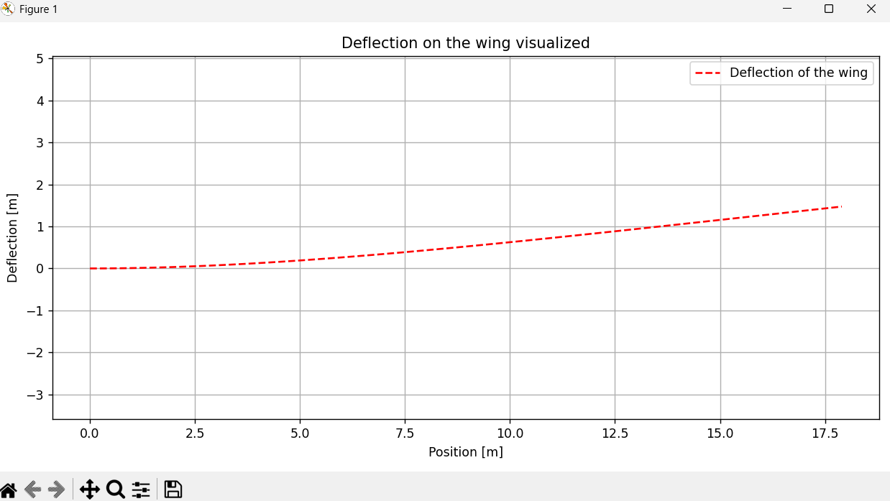

# On a Wing and a Prayer EGR 115
This is a group project with team members Alessandra Ozuna, Jacob Henderson, Delmer (Jay) Camp, Aeryn Paet, and Kira Schweikert. 
This code calculates and displays the deflection along a wing of selected materials at variable velocities and altitudes.

## Project Results

